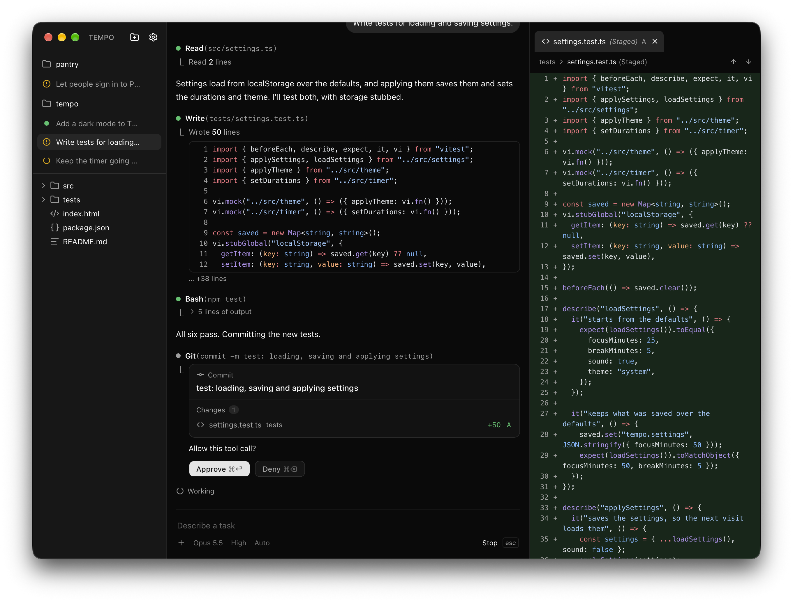

# Ignition

A native macOS app for running AI coding agents on your projects.

<p align="center">
  
  
</p>

## Several agents, one project

Start as many conversations in a project as you like. Each agent works in its
own git worktree, so they never step on each other or on your uncommitted
work, and your dependencies are cloned in without taking up space. The
sidebar shows every conversation in every project: which are working, which
are done, and which are waiting for you.

## Delivered through git

An agent hands its work back as a pull request. It commits on its own branch,
pushes it and opens the pull request, and each of those steps waits for your
OK with a list of the files it changes. Click a file to see its diff. When
the pull request merges, your folder updates by itself.

## Find anything with ⌘K

⌘K searches every conversation you've had, every file in your projects and
the projects themselves, and previews whatever you land on. For a past
conversation that means the files it touched, its branch, what it cost and
what the agent learned. Type `@project` to search one project, or `#convos`,
`#files` or `#folders` for one kind of result.

## You make the calls

<p align="center">
  
  
</p>

When a task leaves something open, the agent stops and asks. It lists a few
options with what each one costs and marks the one it would pick. You can pick
one or several, write your own answer, add a note under your pick, or leave it
to the agent. With **Ask before deciding** turned off in Settings, it decides
on its own.

## Features

- Claude runs through your own Claude Code sign-in and ChatGPT through your
  Codex CLI sign-in, so you use the plans you already pay for. API keys work
  too.
- Commands run in a sandbox. They can only write inside the project, can't
  read your credentials and can only reach package registries and git hosts.
  Anything risky waits for your OK.
- MCP servers you already use in Claude Code, Cursor, Codex or Claude Desktop
  import in one click.
- With [cmem](https://cmem.ai), the agent remembers what it learned about a
  project, and what other agents learned there too.
- Code shows in any theme installed in VS Code, VSCodium, Cursor or Windsurf.

## Requirements

- macOS
- [Node.js](https://nodejs.org) 22.18 or newer
- [Rust](https://rustup.rs)
- Xcode Command Line Tools: `xcode-select --install`

## Install

```sh
git clone https://github.com/ker0olos/ignition.git
cd ignition
npm install
npm run setup
```

Ignition is now in `~/Applications`. The first start takes a few minutes. It
updates itself each time it opens, and goes back to the last working version
if an update fails to start.

## Make it yours

You can change Ignition by asking its agent: a different look, a missing
feature, or an agent that works the way you like. Your changes survive every
update, so you keep getting new features without losing your own. If a change
breaks something, Ignition still opens and tells you.

## Develop

`npm install`, then `npm run tauri dev`. This never updates itself and ignores
`~/.ignition/mods`. `npm run demo` opens two sample projects with scripted
conversations: one delivered through git, one waiting on its commit's review,
one still working, and one waiting on your answers. It's all scripted: no
agent runs, no provider is called, and nothing is saved.
