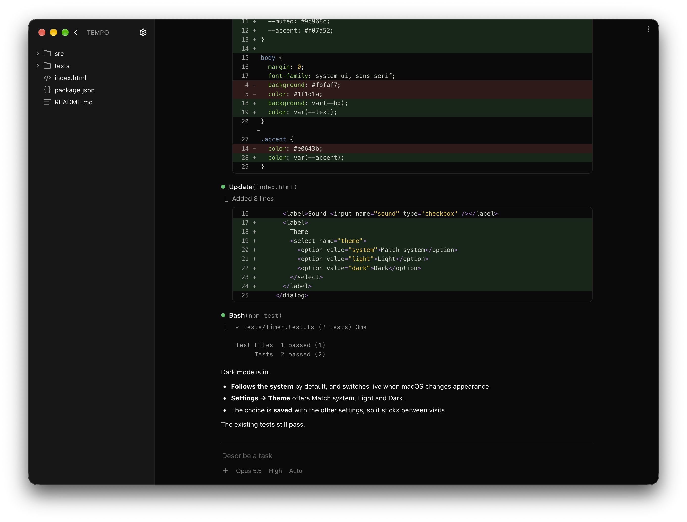
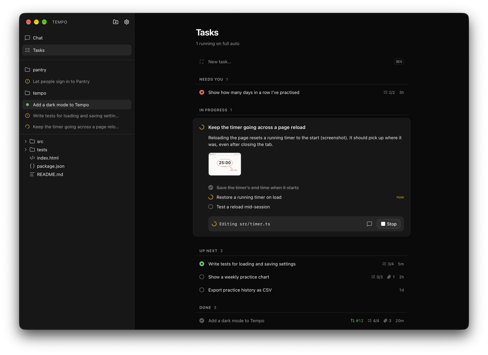
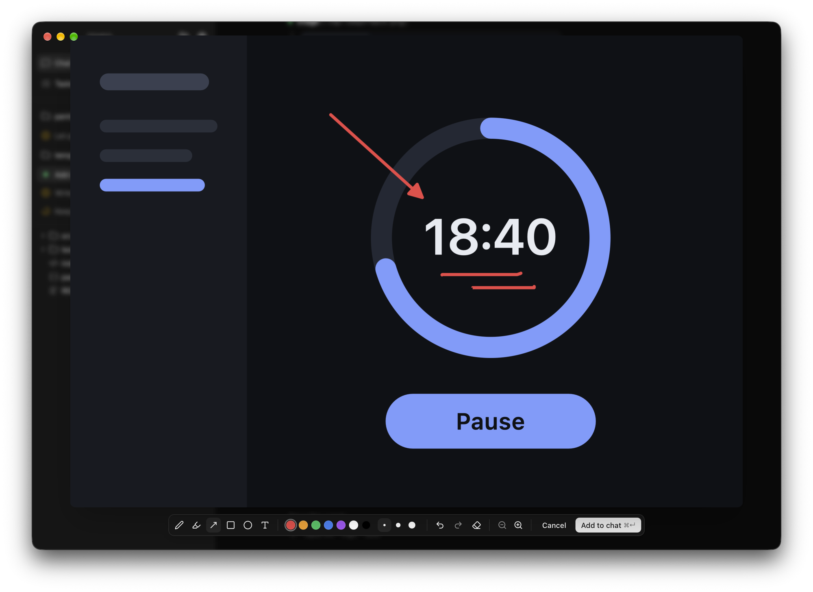
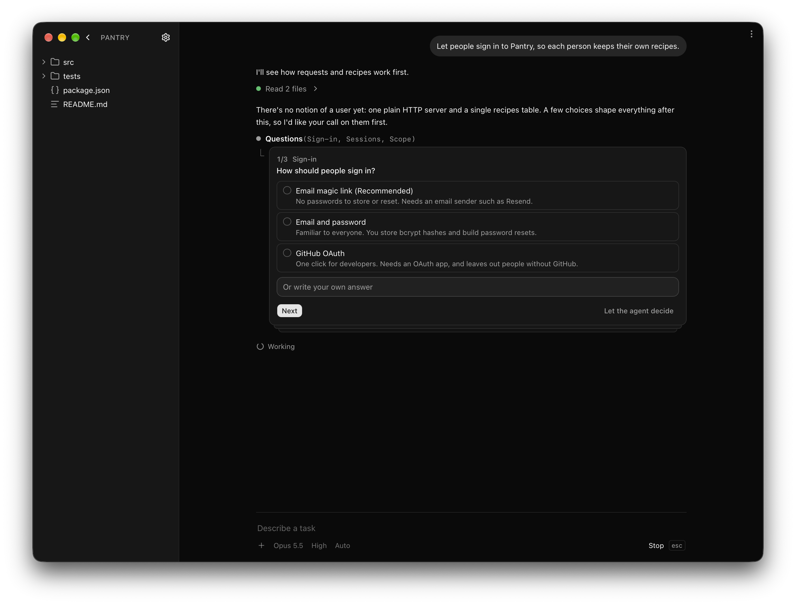
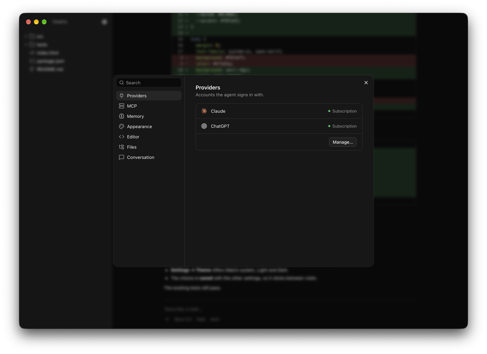

# Ignite

**The only AI coding app you'll need.** Hand off work, draw on what's wrong,
review the pull request.

A native macOS app for running AI coding agents on your projects, several at
once.

<p align="center">
  
  
  
</p>
<p align="center">
  
  
</p>

## Features

- Run several agents at once. Each conversation works in its own git
  worktree, so agents never touch each other's work or yours, and the sidebar
  shows which are working, done or waiting for you.
- Work comes back as a pull request, every file's diff a click away, and your
  folder updates when it merges.
- Write a task, attach screenshots or sketches, pick a model and start it.
  The agent plans the subtasks, works through them on its own and brings you
  its pull request to approve, stopping only when it needs you.
- Click any image, yours or one the agent took, and draw on it: pen,
  highlighter, arrows, boxes and text, zooming in for detail. Then add it to
  the chat or a task to show the agent what you mean.
- When a decision is open, the agent asks you, with a few options and what
  each one costs. Pick one, write your own answer, or leave it to the agent.
- Claude and ChatGPT through your Claude Code and Codex sign-ins, so you use
  the plans you already pay for. API keys work too.
- Commands run in a sandbox: they write only inside the project, can't read
  your credentials and reach only package registries and git hosts. Anything
  risky asks first.
- ⌘K searches every conversation, file and project.
- Skills and MCP servers import from Claude Code, Codex, Cursor and Claude
  Desktop in one click.
- With [cmem](https://cmem.ai), agents remember what they learned about a
  project.
- Code shows in any theme from VS Code, VSCodium, Cursor or Windsurf.
- Use it from your phone on the same Wi-Fi: Settings → Remote, then scan the
  QR code.

## Install

Needs macOS, [Node.js](https://nodejs.org) 22.18 or newer,
[Rust](https://rustup.rs) and the Xcode Command Line Tools
(`xcode-select --install`).

```sh
git clone https://github.com/ker0olos/ignite.git
cd ignite
npm install
npm run setup
```

Ignite is now in `~/Applications`. It updates itself each time it opens,
and goes back to the last working version if an update fails to start.

## Make it yours

Ask its agent to change Ignite itself: a different look, a missing feature.
Your changes survive every update, and if one breaks something, Ignite still
opens and tells you.

## Develop

`npm install`, then `npm run tauri dev`, which never updates itself and
ignores `~/.ignite/mods`. `npm run demo` opens two sample projects with
scripted conversations and tasks; no agent runs and nothing is saved.
